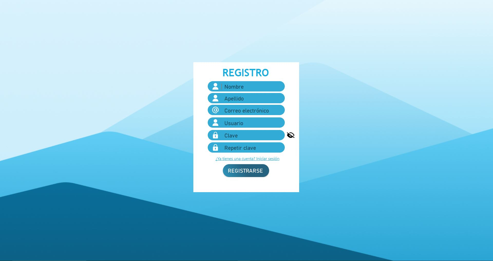
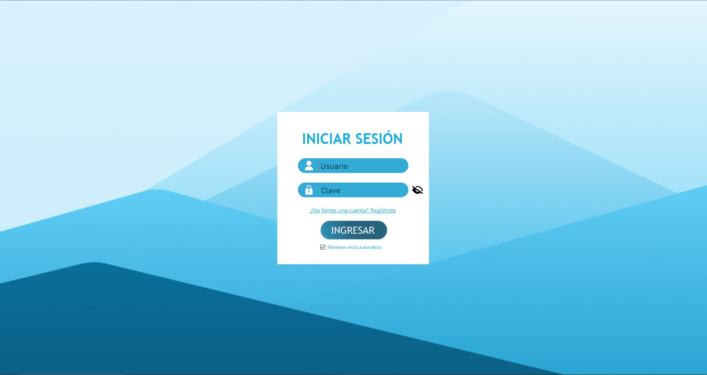
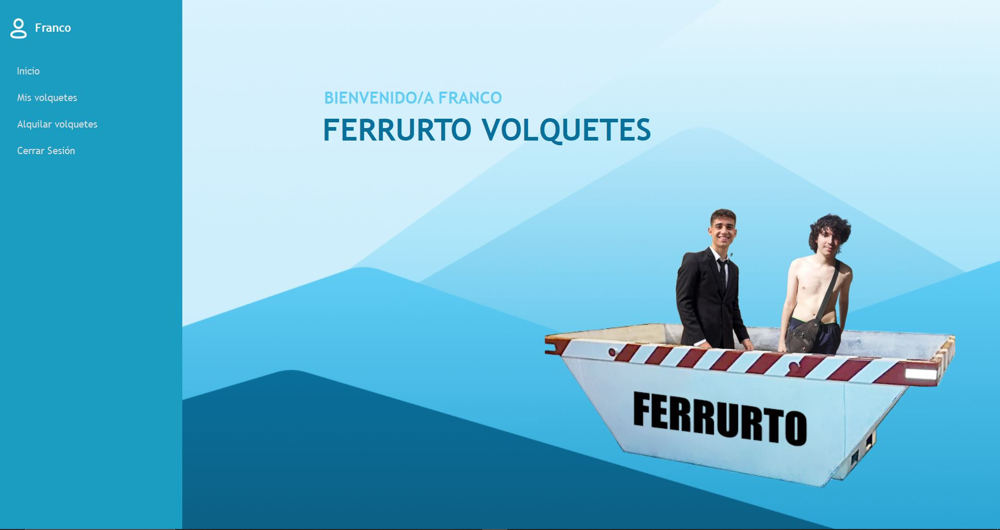
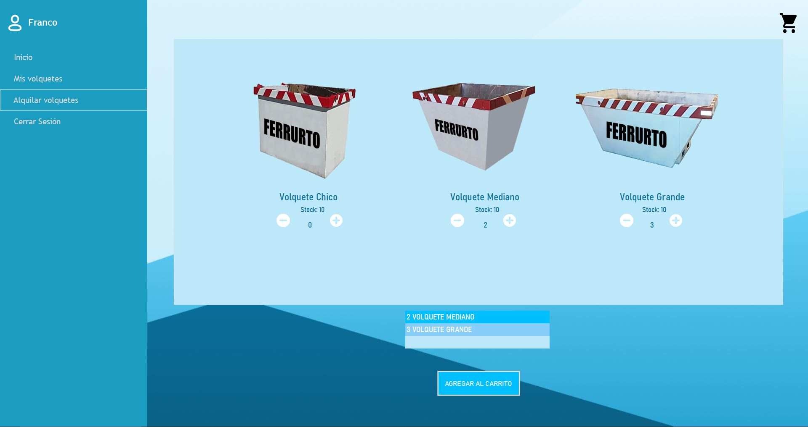
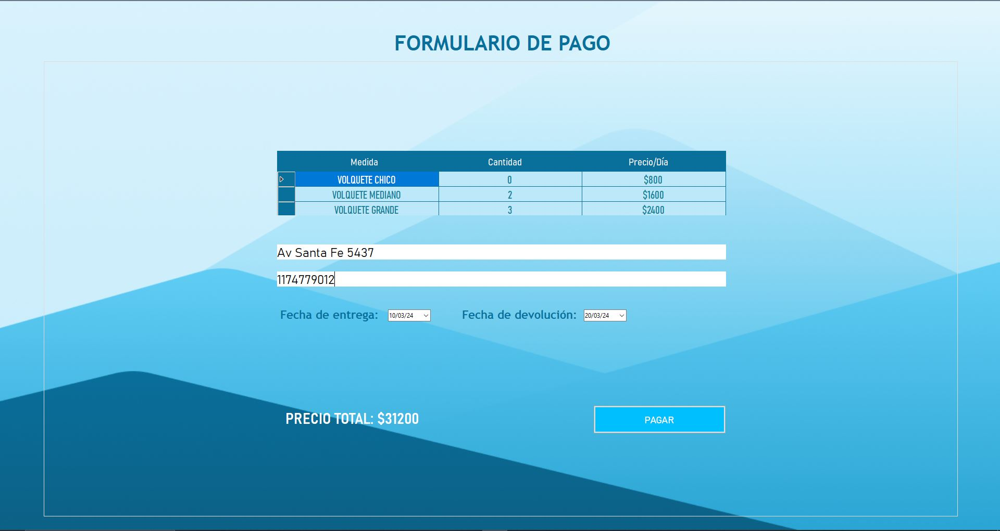
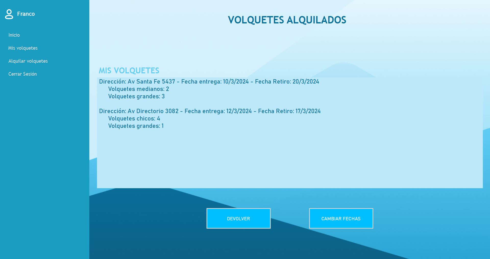
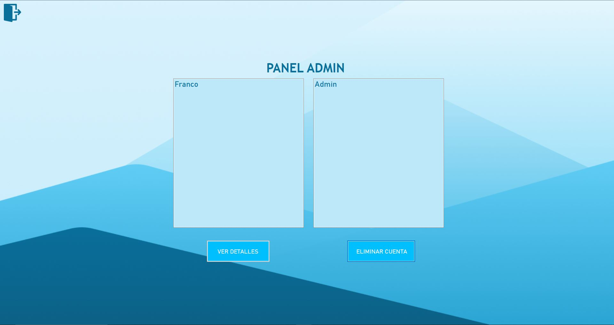
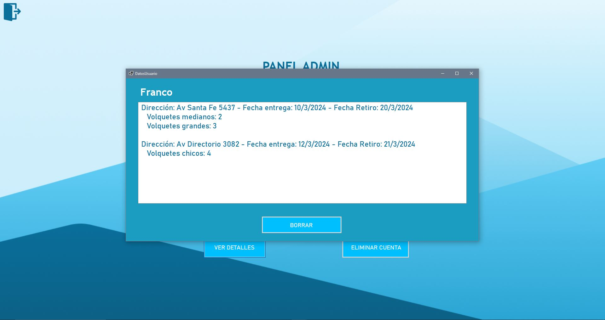

# Alquiler Volquetes: FERRURTO

## Descripción

Este proyecto fue realizado en colaboración por Ivo Curto Eivers y Franco Ferrari durante el segundo semestre de 2023 para la materia Laboratorio de Computación 2.
El programa es un gestor de alquileres de volquetes, el mismo cuenta con una interfaz diseñada para que los clientes puedan registrarse, inciar sesión, alquilar distintos volquetes, especificar lugar y fecha de entrega, y modificar sus pedidos. Por otro lado tambien cuenta con un registrador (privado) de administradores los cuales pueden acceder a ventanas unicas las cuales permiten modificar tanto pedidos como usuarios y la posibilidad de eliminar los mismos.

## Tecnologías Utilizadas

- C#
- .Net
- MySql

## Ventanas Cliente

### Registro

### Inicio Sesión

### Pantalla Inicial

### Pantalla de Alquiler

### Pantalla de Pago

### Pantalla de Gestión de Pedidos

## Ventanas Admin

### Pantalla Principal

### Edición de Pedido

## Instrucciones de Ejecución

1. Clona el repositorio.
2. Instala las dependencias (si es necesario).
3. Importar la base de datos que se encuentra en "\AlquilerVolquetes\resources\alquiler_volquetes.sql"
3. Ejecuta el main.

## Conceptos Dominados
- Programación Orientada a Objetos.

- Windows Forms

- Paquete .Net

- Bases de Datos Relacionales

- Unit Testing

- Serializacion en XML

- Patrón N Capas

- CRUD

## Agradecimientos
- Profesores de la Cursada: Germán Scarafilo, Giovanni Luccheta, Mario Rampi.

- Abril Carvani (Edición de imagenes).

